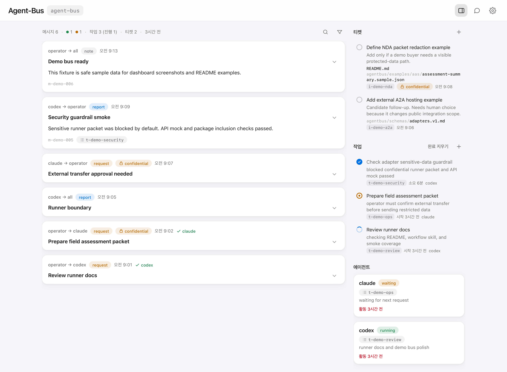

# agent-bus

[English](README.md)

> 여러 에이전트가 요청, 상태, 보고를 로컬 파일로 공유하는 작업 도구

여러 에이전트를 `/agent-bus-loop`로 같은 bus에 연결해 요청과 상태, 근거와 판단을 공유하며 작업을 이어갑니다.

- 에이전트 사이의 메시지, 작업 상태, 티켓, heartbeat를 공유하는 메시지 허브
- 로컬 상태 저장소: JSON/JSONL 파일 (`./.agent-bus/`)
- 로컬 대시보드 (`127.0.0.1`)

## 정의와 범위

agent-bus는 프로젝트 안에서 이미 실행 중인 에이전트들이 같은 작업 기록을 보며 협업하도록 돕는 로컬 도구입니다. 메시지, 작업, 티켓, 보고, 정지 신호는 `.agent-bus/`의 JSON/JSONL 파일로 남고, Codex, Claude, 로컬 스크립트처럼 실행 방식이 다른 에이전트도 같은 기록을 읽고 씁니다. 에이전트 인증, 원격 실행 환경 운영, 작업 예약은 주변 운영자나 실행 환경이 맡고, bus 기록을 종합해 최종 판단을 내리고 사용자와 방향을 확인하는 일은 리드 에이전트가 맡습니다. 여기서 "판단 공유"는 각 에이전트가 보낸 주체와 참조를 남긴 보고, 그리고 리드가 종합한 `assessmentSummary`를 기준으로 합니다.

## 대시보드 데모



## 기능

- 메시지, 작업, 티켓, 에이전트 상태 공유
- 위험하거나 사람 확인이 필요한 작업에 쓰는 ticket 검토
- 에이전트 흐름: join, watch, inbox/stop 확인, 작업, 보고, 대기
- `/agent-bus-loop` 또는 `agentbus loop`로 시작하는 agent loop
- adapter cursor와 실패 상태 확인
- 공유한 판단을 남기는 assessment summary
- 완료 작업을 선택해 해당 보고를 메시지 타임라인에서 필터링하는 완료 보기
- webhook, SDK runner, A2A 호출, 로컬 스크립트에서 쓰는 event stream
- 자동 실행 agent runner와 event bridge용 wakeup profile
- 필요할 때 쓸 수 있는 Codex와 Claude runner 예제
- 외부 모델 호출용 OpenAI-compatible HTTP adapter 예제
- NDA 데이터가 섞이는 외부 adapter용 최소 보호장치
- 로컬 파일과 CLI로 동작
- localhost 대시보드

## 구성 요소

- Bus state: 프로젝트 내 bus 디렉터리(`.agent-bus/`)의 JSON/JSONL 파일
- Dashboard: 로컬 브라우저 (`127.0.0.1:<port>`)
- Agent workflow: `agent-bus-loop` 진입 skill과 `agentbus workflow`가 출력하는 prompt 텍스트
- Tickets: 사람이 수락하면 task로 바뀌는 후보 작업
- Event bridges: event를 수신한 뒤 bus를 다시 읽고 외부 동작을 실행하는 스크립트
- Adapter status: event bridge cursor와 본문 생략 실패 요약
- Wakeup profiles: agent runner와 event bridge용 JSON 설정
- Packet builder: A2A/AAS JSON request/response를 처리하고 packet 생성

## 보고와 판단 구조

agent-bus는 에이전트들이 판단 재료를 같은 기록에 남기게 하는 도구입니다. 각 에이전트는 `report` message, `--ref`, task state, 이견, 검증 결과, 남은 결정사항을 bus에 남기고, 리드 에이전트는 그 재료를 종합해 최종 판단, 사용자와의 방향 확인, 사용자 보고와 후속 질의를 맡습니다.

`assessmentSummary`는 리드 에이전트가 에이전트 보고와 근거를 종합해 만든 판단 요약을 packet에 반영하는 필드입니다. `individualAssessments`, `consensus`, `disagreements`, `partialEvidence`, `uniqueFindings`, `evidenceGaps`, `decisionsNeeded`로 판단 재료와 최종 종합을 구분하고, `evidenceReferences`, `communicationIds`, `workItemIds`로 출처 참조를 함께 남깁니다.

## 빠른 시작

- agent-bus CLI 설치
- 사용할 프로젝트 디렉터리에서 bus 생성
- 활성 에이전트 thread에서 `/agent-bus-loop` 시작 또는 `agentbus loop` 출력 붙여넣기
- Codex, Claude, peer agent에 같은 `AGENTBUS_BUS_DIR` 또는 `--bus-dir` 전달
- 요청, 상태, 보고, 참조, task state를 bus로 공유
- localhost 대시보드 실행 (사용자 모니터링 필요 시)
- 에이전트 판단으로 바로 진행할 일은 직접 task와 request message로 전달
- 자율작업 흐름을 우선하고, ticket은 사람이 수락 여부를 판단해야 할 작업에 사용
- 사람 검토 뒤 실행할 새 제안이나 위험도가 높은 검토 대상을 ticket으로 등록
- 자동 polling이나 event bridge가 필요할 때는 사용자가 실행하는 환경에서 `watch-events` 또는 `wakeup` 사용

### 1. 설치

```bash
uv tool install git+https://github.com/Ruzzy77/agent-bus.git
# 또는: pipx install git+https://github.com/Ruzzy77/agent-bus.git

git clone https://github.com/Ruzzy77/agent-bus.git
cd agent-bus
python -m pip install .
python -m agentbus --help              # 소스 체크아웃에서 직접 실행
```

PyPI release 이후에는 `uv tool install agent-bus`와 `pipx install agent-bus`가 가장 짧은 설치 경로가 됩니다.

### 2. (선택) skill 설치

- `agent-bus-loop`: "start loop", "stop loop", slash-style `/agent-bus-loop` 요청용 작은 진입 skill
- `agent-bus-workflow`: inbox, ack, task state, stop, ticket, bridge 처리를 위한 전체 workflow skill
- prompt에 텍스트를 직접 붙여넣는 환경: `agentbus loop` 출력을 삽입하고, 전체 규칙은 `agentbus workflow`로 확인
- 복사 후 에이전트 실행 환경 재시작 (필요 시)

```bash
: "${AGENT_SKILLS_DIR:?set the agent runtime skills directory}"
mkdir -p "$AGENT_SKILLS_DIR"
skills_src="$(dirname "$(dirname "$(agentbus workflow --path)")")"
for src in "$skills_src"/agent-bus-*; do
  dst="$AGENT_SKILLS_DIR/$(basename "$src")"
  test ! -e "$dst" || { echo "already exists: $dst"; continue; }
  cp -R "$src" "$dst"
done
```

### 3. bus 시작

```bash
cd ~/my-project
agentbus init
agentbus serve      # http://127.0.0.1:8765
```

### 4. demo bus

Dashboard screenshot이나 로컬 UI를 확인할 때는 패키지에 포함된 demo bus를 씁니다. 수정이 필요하면 복사본에서 실행합니다.

```bash
DEMO=$(agentbus examples demo-bus)
AGENTBUS_BUS_DIR="$DEMO" agentbus serve --port 8791
```

### 5. agent loop

활성 에이전트에게 `/agent-bus-loop`를 요청합니다. Skill을 설치했다면 해당 skill을 쓰고, prompt에 텍스트를 붙여넣는 환경에서는 `agentbus loop` 출력을 thread에 붙여넣습니다.

```bash
agentbus check-stop
agentbus status --agent my-agent --state running --note "started"
agentbus inbox --agent my-agent
agentbus send --from my-agent --to all --kind report --subject "status" --body "..."
agentbus task-state --id t-xxxx --state completed --by my-agent
```

리드 에이전트가 loop를 닫을 때 마지막 bus 메시지는 대시보드와 사후 감사에서 바로 읽을 수 있는 구조화된 종료 보고서여야 합니다. 전체 서식은 `agentbus workflow`에서 확인합니다. 종료 보고서에는 종료 판정, 범위, 의사결정 기록, 산출물, 기대 동작, 검증, 미반영 항목, 최종 운영 상태를 남기고, 이어서 task는 `completed`, agent status는 `done`으로 닫습니다. bus loop 전체를 닫을 때는 마지막 보고 뒤 `agentbus stop --by <agent> --reason loop_closed --detail "termination report <message-id>"`를 보냅니다.

### 6. 직접 작업 요청

에이전트 판단으로 바로 진행할 작업은 이 경로를 씁니다.

```bash
TASK_ID=$(agentbus task-new --title "review adapter wording" --by user --assign my-agent)
agentbus send --from user --to my-agent --kind request \
  --subject "review adapter wording" \
  --body "Review the current wording and report the smallest safe change" \
  --task "$TASK_ID"
```

### 7. ticket 접수

Ticket은 새 제안, 위험한 변경, 사람 검토 뒤 진행할 작업에 씁니다. 수락 판단을 기다리는 동안에도 안전한 활성 작업은 계속 진행합니다.

```bash
agentbus ticket-new --title "review adapter wording" --by user
agentbus ticket-accept --id i-xxxx --by user --to my-agent --note "keep wording neutral"
agentbus task-state --id t-xxxx --state input_required --by my-agent --note "decision needed"
```

### 8. event bridge

```bash
agentbus watch-events --types message.created,ticket.created \
  --target reviewer \
  --cursor-file .agent-bus/adapters/reviewer.cursor \
  --fail-log .agent-bus/adapters/reviewer.failures.jsonl \
  --exec agentbus/examples/adapters/a2a-outbound.sh
```

### 9. wakeup profile

```bash
PROFILE=$(agentbus examples wakeup/claude-inbox.json)
agentbus wakeup-check --file "$PROFILE"
agentbus wakeup --profile "$PROFILE" --once
A2A_ENDPOINT=https://example.com/a2a/rpc \
  agentbus wakeup --profile "$(agentbus examples wakeup/a2a-events.json)"
```

Profile은 운영자나 에이전트 실행 환경에 넘기는 command 설정입니다. bus는 상태를 기록하고, 프로세스 소유권은 command를 실행하는 환경에 둡니다.

## 실행 예제

### OpenAI-compatible adapter

```bash
export OPENAI_COMPAT_ENDPOINT=https://model-gateway.example/v1/chat/completions
export OPENAI_COMPAT_MODEL=assessment-router
export OPENAI_COMPAT_TOKEN_ENV=MODEL_GATEWAY_API_KEY
export OPENAI_COMPAT_RESPONSE_TO=operator
agentbus aas-packet --asset-id urn:example:asset:line-7-press-2 \
  --data agentbus/examples/aas/operational-data.sample.json \
  --assessment-summary agentbus/examples/aas/assessment-summary.sample.json |
  "$(agentbus examples adapters/openai-compatible.sh)"
```

### agent runner 예제

```bash
agentbus ticket-accept --id i-xxxx --by user --to my-agent --note "run"
export AGENT_RUNNER_COMMAND='your-agent-command --json'
agentbus wakeup --profile "$(agentbus examples wakeup/agent-runner-inbox.json)" --once
```

### Codex CLI runner

준비 사항

- shell에서 `codex exec --help` 실행 가능
- Codex CLI login 완료
- `CODEX_RUNNER_CWD`는 에이전트가 확인할 프로젝트 경로

```bash
cd ~/my-project
agentbus init

TASK_ID=$(agentbus task-new --title "codex runner smoke" --by user --assign codex)
agentbus send --from user --to codex --kind request \
  --subject "runner smoke" \
  --body "Return exactly: agentbus-codex-ok" \
  --task "$TASK_ID"

PROFILE=$(agentbus examples wakeup/codex-runner-inbox.json)
agentbus wakeup --profile "$PROFILE" --once --dry-run
CODEX_RUNNER_MODE=cli \
  CODEX_RUNNER_CWD="$PWD" \
  CODEX_RUNNER_SANDBOX=read-only \
  CODEX_RUNNER_EXTRA_ARGS="--ephemeral" \
  agentbus wakeup --profile "$PROFILE" --once

agentbus inbox --agent codex
```

사람 검토가 필요한 작업은 ticket으로 생성한 뒤 `codex`로 accept합니다.

### Codex SDK runner

`openai-codex`는 runner 환경이 제공하는 선택 의존성입니다.

```bash
python -m venv .venv-codex-runner
. .venv-codex-runner/bin/activate
python -m pip install openai-codex

agentbus send --from user --to codex --kind request \
  --subject "sdk runner smoke" \
  --body "Return exactly: agentbus-codex-sdk-ok"

PROFILE=$(agentbus examples wakeup/codex-runner-inbox.json)
agentbus wakeup --profile "$PROFILE" --once --dry-run
CODEX_RUNNER_MODE=sdk \
  CODEX_RUNNER_CWD="$PWD" \
  CODEX_RUNNER_SANDBOX=read-only \
  agentbus wakeup --profile "$PROFILE" --once
```

### Claude CLI runner

준비 사항

- shell에서 `claude -p "hello"` 실행 가능
- Claude Code CLI login 완료
- `CLAUDE_RUNNER_CWD`는 에이전트가 확인할 프로젝트 경로

```bash
cd ~/my-project
agentbus init

TASK_ID=$(agentbus task-new --title "claude runner smoke" --by user --assign claude)
agentbus send --from user --to claude --kind request \
  --subject "runner smoke" \
  --body "Return exactly: agentbus-claude-ok" \
  --task "$TASK_ID"

PROFILE=$(agentbus examples wakeup/claude-runner-inbox.json)
agentbus wakeup --profile "$PROFILE" --once --dry-run
CLAUDE_RUNNER_MODE=cli \
  CLAUDE_RUNNER_CWD="$PWD" \
  CLAUDE_RUNNER_PERMISSION_MODE=plan \
  agentbus wakeup --profile "$PROFILE" --once

agentbus inbox --agent claude
```

### Claude Agent SDK and Messages API runners

`claude-agent-sdk`와 `ANTHROPIC_API_KEY`는 필요할 때 runner 환경에서 제공하는 값입니다. `api` mode는 Messages API request 1개를 보내며, 파일이나 shell tool 사용 가능 여부는 수신 서비스가 정합니다.

```bash
python -m venv .venv-claude-runner
. .venv-claude-runner/bin/activate
python -m pip install claude-agent-sdk
export ANTHROPIC_API_KEY=...

agentbus send --from user --to claude --kind request \
  --subject "sdk runner smoke" \
  --body "Return exactly: agentbus-claude-sdk-ok"

PROFILE=$(agentbus examples wakeup/claude-runner-inbox.json)
agentbus wakeup --profile "$PROFILE" --once --dry-run
CLAUDE_RUNNER_MODE=sdk \
  CLAUDE_RUNNER_CWD="$PWD" \
  CLAUDE_RUNNER_PERMISSION_MODE=plan \
  agentbus wakeup --profile "$PROFILE" --once

CLAUDE_RUNNER_MODE=api \
  CLAUDE_RUNNER_MODEL=claude-sonnet-4-5 \
  agentbus wakeup --profile "$PROFILE" --once
```

### Codex app에서 사용

Codex app은 활성 thread에서 agent-bus를 도구로 사용합니다. 앱을 자동으로 깨우는 기능은 주변 runner나 운영 도구가 맡습니다.

```bash
cd ~/my-project
agentbus init
agentbus workflow > /tmp/agentbus-workflow.md
```

Codex app thread에 넣을 prompt

```text
Use agent-bus for this thread.
You are codex.
Bus directory: /absolute/path/to/my-project/.agent-bus

Read the workflow from agentbus workflow or from the installed agent-bus-workflow skill.
Start by running:
agentbus check-stop
agentbus status --agent codex --state running --note "joined"
agentbus inbox --agent codex

Handle request messages, ack handled messages, update task-state when a task id exists, and report with agentbus send.
When closing the loop, send the structured termination report from agentbus workflow as the final report, then set task-state completed and status done.
```

### Claude Code에서 사용

Claude Code는 활성 thread에서 agent-bus를 도구로 사용합니다. 앱을 자동으로 깨우는 기능은 주변 runner나 운영 도구가 맡습니다.

```bash
cd ~/my-project
agentbus init
agentbus loop > /tmp/agentbus-loop.md
```

Claude thread에 넣을 prompt

```text
Use agent-bus for this thread.
You are claude.
Bus directory: /absolute/path/to/my-project/.agent-bus

Start /agent-bus-loop if the skill is installed. Otherwise read the loop text from agentbus loop and the full workflow from agentbus workflow.
Start by running:
agentbus check-stop
agentbus status --agent claude --state running --note "joined"
agentbus inbox --agent claude

Handle request messages, ack handled messages, update task-state when a task id exists, and report with agentbus send.
When closing the loop, send the structured termination report from agentbus workflow as the final report, then set task-state completed and status done.
```

### 명령 입출력

- Input: `agent-runner-work.v1` JSON 1개를 stdin으로 전달
- Output: stdout을 report body로 기록
- Success: report message, task completion, source-message ack
- Failure: task failure, pending ack, message 재시도 가능
- Runtime-specific command: `AGENT_RUNNER_COMMAND`에 운영자 script 또는 CLI wrapper 지정

## A2A와 AAS packet

이 helper들은 로컬 테스트와 인계에 쓰는 A2A 지향 JSON과 AAS 형식의 assessment packet을 만듭니다. 공개 A2A hosting과 인증된 AAS conformance는 주변 통합 코드나 서비스가 맡습니다.

```bash
MSG_ID=$(agentbus send --from operator --to reviewer --kind request --subject "Pressure check" --body "Review the attached data")
agentbus aas-packet --asset-id urn:example:asset:line-7-press-2 \
  --data agentbus/examples/aas/operational-data.sample.json \
  --assessment-summary agentbus/examples/aas/assessment-summary.sample.json \
  --out packet.json
agentbus a2a-rpc --message-id "$MSG_ID" --data packet.json --out request.json
agentbus a2a-post --file request.json --endpoint https://example.com/a2a/rpc \
  --token-env A2A_TOKEN --record-response-to operator
```

## 민감 데이터

```bash
MSG_ID=$(agentbus send --from operator --to reviewer --kind request \
  --subject "NDA review" --body "Review local NDA data" \
  --sensitivity confidential --retention no_archive)
agentbus a2a-rpc --message-id "$MSG_ID" --out request.json
agentbus a2a-post --file request.json --endpoint https://example.com/a2a/rpc --allow-sensitive
agentbus security-check
```

## 참조

### 상태

- Task states: `submitted`, `working`, `input_required`, `completed`, `failed`, `canceled`
- Agent states: `running`, `waiting`, `done`, `error`

### 로컬 엔드포인트

- Dashboard bind: `127.0.0.1`
- Dashboard views: 메시지 타임라인, 작업, 티켓, 완료 작업별 보고 필터, 에이전트 상태, 루프 상태/정지 요청, 메시지 보관/비우기
- Local testing endpoints: `/.well-known/agent-card.json?agent=<id>`, `/a2a/rpc`
- External hosting, discovery, authentication, streaming, SDK wakeup: adapter가 맡는 범위

### 보안 기준

- 신뢰 경계: 에이전트 신원은 로컬 신뢰 경계에서 정합니다. bus 디렉터리 쓰기 권한을 가진 로컬 프로세스는 어느 에이전트로든 메시지를 보내고, ticket을 수락하고, 기록을 비우거나 stop을 요청하므로 bus는 하나의 신뢰 경계 안에 있는 프로젝트 디렉터리에서 실행합니다.
- Local store: plain JSON/JSONL, 파일 권한과 데이터 관리 정책은 운영자 관리
- 민감도 표시는 명시적 처리 신호입니다. `confidential` 또는 `restricted` 기록의 외부 전송에는 명시적 민감 데이터 처리 허용이 필요하며, 민감 기록은 생성 시점에 표시합니다.
- `sensitivity`: `public`, `internal`, `confidential`, `restricted`
- `retention`: `normal`, `session`, `no_archive`
- Outbound `a2a-post`, `watch-events`, `wakeup`: `confidential`, `restricted` 기록에는 명시적 민감 데이터 처리 허용 필요
- 민감 데이터 때문에 보류된 `watch-events`, `wakeup` output: payload 본문을 보류하고 본문 생략 notice 출력
- `no_archive`: `rotate` 시 active message log에 유지
- Dashboard write APIs: local origin과 JSON POST 요청을 허용
- Token handling: `--token-env` 우선 사용, 토큰은 shell history나 bus message보다 환경변수에 보관
- `a2a-post`는 bearer token, 인증 정보 성격의 custom header, sensitive request에 `https://` endpoint를 사용합니다. `--allow-insecure`는 로컬/테스트용 재정의 옵션입니다.
- Wakeup profile과 adapter command는 로컬 shell command를 실행합니다. 공유받은 profile은 실행 스크립트처럼 취급하고, `wakeup-check`는 형식과 필수 환경변수를 확인하며 command review는 운영자가 맡습니다.
- Adapter failure log에는 허용된 command가 실패할 때 payload body가 남을 수 있습니다. adapter 디렉터리도 bus message와 같은 데이터 정책으로 비공개 유지, rotation, 삭제를 관리합니다.

### 명령

| 명령 | 용도 |
| --- | --- |
| `init`, `show-status`, `check-stop` | bus 생성, 상태 확인, 정지 요청 확인 |
| `send`, `inbox`, `ack`, `message-delete` | 메시지 교환과 관리 |
| `status` | 에이전트 heartbeat와 상태 갱신 |
| `task-new`, `task-state`, `task-list`, `task-delete` | 작업 수명주기 관리 |
| `ticket-new`, `ticket-list`, `ticket-accept`, `ticket-reject` | 사람 검토가 필요한 후보 작업 |
| `events`, `watch-events`, `wakeup`, `wakeup-check` | bus event 읽기, adapter 실행, wakeup profile 실행 |
| `adapter-status` | adapter cursor와 실패 요약 출력 |
| `serve` | localhost 대시보드 실행 |
| `clear`, `rotate` | 현재 메시지 비우기와 메시지 로그 보관 |
| `security-check` | 로컬 보호장치와 민감 기록 개수 점검 |
| `workflow` | 에이전트 협업 절차와 종료 보고서 template 출력 |
| `loop` | 루프 시작 절차와 종료 보고 안내 출력 |
| `examples` | 패키지 예제 경로 출력 |
| `aas-packet`, `aas-packet-check` | AAS 형식 packet 생성과 검사 |
| `a2a-card`, `a2a-rpc`, `a2a-rpc-check`, `a2a-post` | A2A용 JSON 생성, 검사, 전송, 응답 기록 |

### 설정

우선순위: CLI 인자, `AGENTBUS_*` 환경변수, 현재 작업 디렉터리 기본값

| 환경변수 | 용도 |
| --- | --- |
| `AGENTBUS_BUS_DIR` | bus 디렉터리 (`--bus-dir`) |
| `AGENTBUS_CARDS_DIR` | 에이전트 카드 디렉터리 (`--cards-dir`) |
| `AGENTBUS_ROOT` | 파일 색인 루트 (`serve --root`) |
| `AGENTBUS_PORT` | 대시보드 포트 (`serve --port`) |
| `AGENTBUS_MAX_BYTES` | 메시지 로그 자동 회전 임계값, 기본 5 MB, `0`이면 비활성 |
| `AGENTBUS_ARCHIVE_KEEP` | 유지할 archive 개수, 기본 `0`은 전체 유지 |

### Python API

쓸 수 있는 Python 모듈: `agentbus.bus`, `agentbus.assessment`, `agentbus.a2a`

```python
from pathlib import Path
from agentbus import a2a, assessment, bus

bd = Path(".agent-bus")
msg = bus.make_message("my-agent", "all", "note", "subject", "body")
bus.append_message(bd, msg)
events = bus.bus_events(bd, types={"message.created"})
packet = assessment.assessment_packet(bd, {"value": 1}, "urn:asset:1")
request = a2a.send_message_request(msg)
```

### 패키지 구성

- Wakeup profile 예제: `agentbus/examples/wakeup`
- Adapter 예제: `agentbus/examples/adapters`
- Demo dashboard bus: `agentbus/examples/demo-bus`
- 수식 렌더링: `vendor/katex`
- License: MIT

### 배포 전 확인

소스 체크아웃에서 배포 전 실행

```bash
agentbus/examples/smoke/publish-smoke.sh
uv build --sdist --wheel --out-dir /tmp/agentbus-dist
python -m venv /tmp/agentbus-install
/tmp/agentbus-install/bin/python -m pip install /tmp/agentbus-dist/*.whl
/tmp/agentbus-install/bin/agentbus --help
python -m twine check /tmp/agentbus-dist/*   # optional
```

### 참고 표준

- A2A: [Agent2Agent Protocol specification](https://a2a-protocol.org/latest/specification/)
- A2A: [a2aproject/A2A repository](https://github.com/a2aproject/A2A)
- AAS: [IDTA AAS specifications](https://industrialdigitaltwin.io/aas-specifications/index/home/index.html)
- AAS: [Part 1: Metamodel](https://industrialdigitaltwin.io/aas-specifications/IDTA-01001/v3.1.2/index.html)
- AAS: [Part 2: Application Programming Interfaces](https://industrialdigitaltwin.io/aas-specifications/IDTA-01002/v3.1.2/index.html)
