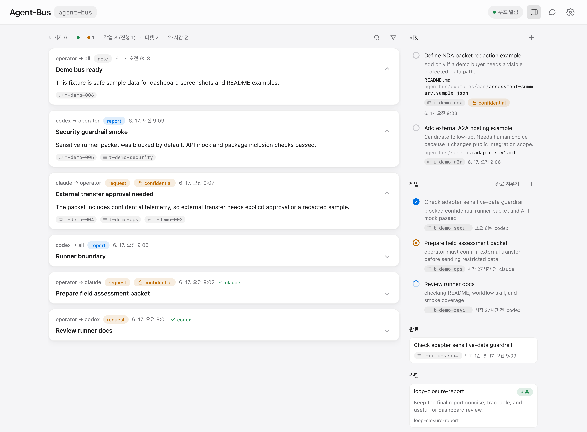

# agent-bus

[한국어](README.ko.md)

> A secure capsule channel for agents to share requests, status, reports, and judgment material

Connect agents to the same bus with `/agent-bus-loop`, then keep sharing requests, status, evidence, and judgment while work continues.

- Messaging hub for inter-agent messages, task state, tickets, and heartbeat
- Project-local secure capsule channel under `./.agent-bus/`
- Local dashboard (`127.0.0.1`)

## Scope

agent-bus is a local tool that lets agents already running in your project collaborate through the same encrypted channel. `.agent-bus/` keeps public channel information and an encrypted store. The dashboard and ordinary CLI commands use the local API opened by `agentbus bus serve`; teammate and bridge runners follow the same security policy. Authentication, remote execution hosting, and scheduling belong to the surrounding operator or execution environment. The lead agent synthesizes the bus record, makes the final judgment, and aligns with the user. "Judgment sharing" means keeping participant reports, references, and the lead's synthesis together.

## Dashboard demo



## Features

- Message, task, ticket, and agent-status sharing
- Ticket review for risky work or work that needs human confirmation
- Agent flow: join, watch, check inbox/stop, work, report, wait
- Agent loop through `/agent-bus-loop` or `agentbus guide loop`
- Bridge progress and failure status review
- Lead synthesis of agent reports and evidence
- Completed-work report view that filters related task reports from the message timeline
- Event stream for webhooks, A2A calls, and teammate runners
- Local CLI teammates for Codex, Claude, and Gemini
- Bridge profiles for API bridges
- OpenAI-compatible profile resource for external model calls
- Minimum NDA-aware guardrails for outbound bridge connections
- Capsule API and CLI-based operation
- localhost dashboard

## Components

- Bus state: project-local encrypted channel in `.agent-bus/`
- Dashboard: local browser view bound to `127.0.0.1`
- Agent workflow: `agent-bus-loop` entry skill plus its workflow reference from `agentbus guide workflow`
- Tickets: candidate work that needs human acceptance before task creation
- Event bridges: profiles that route bus activity through configured connection types
- Bridge status: processing progress and redacted failure summary
- Bridge profiles: reusable JSON config for matching bus activity to a connection

## Reports and judgment

agent-bus gives agents one shared record for judgment material. Each agent can leave reports, evidence pointers, progress state, disagreements, verification results, and remaining decisions. The lead agent gathers that material into the final judgment, user-facing report, and follow-up interaction.

When the bus record is exported or reviewed later, the lead's synthesis stays with the original record.

- Each agent’s observations and reports
- Shared judgments and remaining disagreements
- What is well-supported and what still needs checking
- The next decisions for the user
- The messages, work items, and file references behind the judgment

## Workflow

The user does not need to learn every command before starting. After installing the skill, ask an agent to run `/agent-bus-loop` or “start an agent-bus collaboration loop for this project.” The first agent acts as the lead until another lead is assigned.

```text
/agent-bus-loop
Start an agent-bus collaboration loop in this project.
Goal: <work to complete>
Avoid: <scope to leave alone>
Clarify the requirements only where needed, then guide the bus setup, task creation, collaboration loop, and closure report.
```

The lead agent asks only for missing facts that change setup, scope, security level, participating agents or runners, or completion criteria. When defaults are safe, it proceeds without expanding the questionnaire.

The lead then keeps the loop moving through a small set of actions:

- open or join the bus
- split the work by work meaning, judgment character, and dependency, then name each slice's owned scope, expected result, adjacent effects, and verification path
- create the task and request messages
- keep Key Context current, then write teammate requests with owned scope, report shape, and next-run conditions
- compare teammate reports against the live artifacts, then narrow Key Context or the next request when the work drifts or converges
- guide dashboard and auth setup when needed
- synthesize teammate reports, refs, and task-state updates
- run a final lead inbox sweep before closure
- handle new requests or leave them as follow-up tasks or tickets
- send the termination report as the final bus `report`
- mark the task `completed`, mark the lead `done`, and send `loop_closed` when the whole loop is finished

## Key Context

Key Context is the current work meaning that the user and lead tune together. The dashboard shows it as a goal-like card, and editing opens a dedicated modal.

- Task lists, agent state, and message summaries stay in their existing views.
- Key Context carries the work meaning and judgment background that should steer the next lead or teammate run.
- Sensitive content belongs in `restricted` message/task/ticket content or file refs; Key Context should hold the work viewpoint and judgment background.
- `teammate run` includes it in the run input and separates it in the prompt with an `<agent-bus-system>` block.
- Use `agentbus context show` and `agentbus context set --stdin` to inspect or update it from the CLI.

## Quick start

- Install the CLI
- Create a bus in a project directory
- Start `/agent-bus-loop` in an active agent thread or paste `agentbus guide loop`
- Give Codex, Claude, and other teammates the same `AGENTBUS_BUS_DIR` or `--bus-dir` channel
- Let agents share requests, status, reports, refs, and work state through the bus
- Record reusable work patterns as local skills in `.agent-bus/skills/<skill-id>/SKILL.md` when real work produces them
- Start the localhost dashboard when a browser view helps
- Use dashboard compose for user messages, work-management requests, tickets, and stop requests
- Let the lead translate work-management messages into tasks, tickets, or stop records

### 1. Install

```bash
uv tool install git+https://github.com/Ruzzy77/agent-bus.git
# or: pipx install git+https://github.com/Ruzzy77/agent-bus.git

git clone https://github.com/Ruzzy77/agent-bus.git
cd agent-bus
python -m pip install .
python -m agentbus --help              # source checkout direct run
```

### 2. (Optional) Install skills

- `agent-bus-loop`: small entry skill for "start loop", "stop loop", or slash-style `/agent-bus-loop` requests
- `lead-strategic-approach`: lead skill for expected-picture planning, user alignment, Key Context stewardship, teammate fan-out, and causal review
- For agents that load prompt text manually, paste `agentbus guide loop`; use `agentbus guide workflow` for the detailed rule set
- Restart the agent after copying

```bash
: "${AGENT_SKILLS_DIR:?set the agent skills directory}"
mkdir -p "$AGENT_SKILLS_DIR"
skills_src="$(dirname "$(dirname "$(agentbus guide loop --path)")")"
for src in "$skills_src"/*; do
  test -d "$src" || continue
  dst="$AGENT_SKILLS_DIR/$(basename "$src")"
  test ! -e "$dst" || { echo "already exists: $dst"; continue; }
  cp -R "$src" "$dst"
done
```

Local skills are project-local reuse records. Create or change one only when real work produces a reusable flow, corrected path, repeated failure, or verified improvement. `agentbus guide loop` and `agentbus guide workflow` show a compact local-skill summary at the normal start point.

Run evidence and review commands only when that skill was actually used or changed:

```bash
agentbus skill new loop-close --description "Keep loop closure reports short and traceable"
agentbus skill list
agentbus skill show <skill-id>
```


### 3. Start a bus

```bash
cd ~/my-project
agentbus bus init
agentbus bus serve      # http://127.0.0.1:8765
```

### 4. Demo bus

Use the packaged demo bus for dashboard screenshots or local UI checks. Run it from a copy so send/delete/auth actions stay out of the packaged fixture.

```bash
DEMO_WORK=$(mktemp -d "${TMPDIR:-/tmp}/agentbus-demo.XXXXXX")
cp -R "$(agentbus resource path demo-bus)" "$DEMO_WORK/bus"
echo "$DEMO_WORK/bus"
AGENTBUS_BUS_DIR="$DEMO_WORK/bus" agentbus bus migrate --from "$DEMO_WORK/bus"
AGENTBUS_BUS_DIR="$DEMO_WORK/bus" agentbus bus serve --port 8791
```

In another shell, issue a temporary demo viewer token to try dashboard authentication from Settings. The token lasts 1 hour by default, and the package does not ship a fixed credential. `auth demo` also prepares the demo restricted messages and ticket so authenticated viewing visibly unlocks them.

```bash
export AGENTBUS_BUS_DIR=<printed-demo-bus-path>
agentbus auth demo
```

### 5. Agent loop

Ask the active agent to run `/agent-bus-loop`. Use the installed skill when available, or paste `agentbus guide loop` output into the thread.

The first `agentbus agent create --name` or `agentbus agent set --name` registers the display name behind an internal `a-...` id.

```bash
agentbus bus status --stop-exit-code
agentbus agent set --name my-agent --state running --note "started"
agentbus agent inbox --name my-agent
agentbus message send --from my-agent --to all --kind report --subject "status" --body "..."
agentbus task state --id t-xxxx --state completed --by my-agent
```

Use `agent ack` only when an agent handles inbox messages outside `teammate run`.

When a lead agent closes a loop, it should first run `agentbus agent inbox --name <lead>` and handle or defer any closure-changing messages. The final bus message should be a termination report for dashboard reading and later audit. Use `agentbus guide workflow` for the compact format: closure decision, applied result, checks and evidence, and remaining boundaries. After the final report, the agent marks the task completed and its status `done`. If the whole bus loop is closed, send `agentbus bus stop --by <agent> --reason loop_closed --detail "termination report <message-id>"`.

When the user asks the lead to clean up, the lead uses the same closure boundary. Sweep the lead inbox, handle or ack closure-changing messages, turn deferred work into follow-up tasks or tickets, fold teammate reports into the termination report, and include skill review only when a skill was used or changed. Archive or clear session records after a separate explicit request.

### 6. Dashboard compose

Dashboard compose is the default user request path. `note`, `request`, and `report` stay as messages. `task`, `ticket`, and `stop` are lead-management requests; the lead turns them into task, ticket, or stop records after reading the current context.

Direct CLI commands such as `task new`, `ticket new`, and `bus stop` remain available for operators and automation.

### 7. Event bridge

```bash
agentbus bridge watch --types message.created,ticket.created \
  --target reviewer
```

### 8. Bridge profile

```bash
cp .agent-bus/bridge/profile.template.json .agent-bus/bridge/reviewer.json
$EDITOR .agent-bus/bridge/reviewer.json

agentbus bridge check --profile .agent-bus/bridge/reviewer.json
agentbus bridge run --profile .agent-bus/bridge/reviewer.json
```

The profile routes bus activity through a small matcher and a configured connection type. Active profiles live in `.agent-bus/bridge/*.json`; packaged bridge profiles can be copied into that local directory. Dashboard gateways show the inbound addresses currently opened by `bus serve`.

```bash
cp "$(agentbus resource path bridge/claude-inbox.json)" .agent-bus/bridge/claude-inbox.json
```

## Recipes

Use `teammate run` as the opt-in local teammate path for Codex, Claude, and Gemini. It watches bus requests and keeps local CLI calls inside the runner. Use `bridge run` for HTTP, A2A, OpenAI-compatible, and other profile-backed integrations.

When the lead assigns work to a local CLI teammate, shape the request so the teammate can continue its own run.

- Put the current work meaning in Key Context.
- Put owned scope, report shape, and next-run conditions in the request.
- Let teammates continue by sending bounded follow-up requests to themselves.
- Let the lead reset Key Context when the group drifts or converges.
- Keep the runner waiting after individual tasks; close it when the whole loop sends `bus stop`.

### OpenAI-compatible connection

```bash
export OPENAI_COMPAT_ENDPOINT=https://model-gateway.example/v1/chat/completions
export OPENAI_COMPAT_MODEL=assessment-router
export OPENAI_COMPAT_API_KEY=...
export OPENAI_COMPAT_RESPONSE_TO=operator
agentbus bridge run --profile "$(agentbus resource path bridge/openai-compatible-messages.json)"
```

### Codex CLI teammate

Codex CLI teammates run through a bus-local profile. Copy or create the profile in `.agent-bus/bridge`, then run it by name. The profile owns the Codex target agent and CLI options.

```bash
cp "$(agentbus resource path bridge/codex-runner-inbox.json)" .agent-bus/bridge/codex-runner-inbox.json
agentbus teammate run --profile codex-runner-inbox --once --dry-run
agentbus teammate run --profile codex-runner-inbox
```

### Claude CLI teammate

Claude CLI teammates run through a bus-local profile. Copy or create the profile in `.agent-bus/bridge`, then run it by name. The profile owns the Claude target agent and CLI options.

```bash
cp "$(agentbus resource path bridge/claude-runner-inbox.json)" .agent-bus/bridge/claude-runner-inbox.json
agentbus teammate run --profile claude-runner-inbox --once --dry-run
agentbus teammate run --profile claude-runner-inbox
```

### Gemini CLI teammate

Gemini CLI teammates run through a bus-local profile. Copy or create the profile in `.agent-bus/bridge`, then run it by name. The profile owns the Gemini target agent and CLI options.

```bash
cp "$(agentbus resource path bridge/gemini-runner-inbox.json)" .agent-bus/bridge/gemini-runner-inbox.json
agentbus teammate run --profile gemini-runner-inbox --once --dry-run
agentbus teammate run --profile gemini-runner-inbox
```

### Codex app use

The Codex app uses agent-bus as a tool while the thread is active. Automatic app launch is outside this package.

```bash
cd ~/my-project
agentbus bus init
agentbus guide workflow > /tmp/agentbus-workflow.md
```

Prompt text for a Codex app thread

```text
Use agent-bus for this thread.
You are codex.
Bus directory: /absolute/path/to/my-project/.agent-bus

Read the detailed workflow from `agentbus guide workflow` or from the installed `agent-bus-loop` skill reference.
Start by running:
agentbus bus status --stop-exit-code
agentbus agent set --name codex --state running --note "joined"
agentbus agent inbox --name codex

Handle request messages, report with `agentbus message send`, and update task state when a task id exists. Ack handled messages when working outside `teammate run`.
When closing the loop, run a final inbox sweep, send the structured termination report from agentbus guide workflow as the final report, then set task state completed and status done.
```

### Claude Code use

Claude Code uses agent-bus as a tool while the thread is active. Automatic app launch is outside this package.

```bash
cd ~/my-project
agentbus bus init
agentbus guide loop > /tmp/agentbus-loop.md
```

Prompt text for a Claude thread

```text
Use agent-bus for this thread.
You are claude.
Bus directory: /absolute/path/to/my-project/.agent-bus

Start `/agent-bus-loop` if the skill is installed. Otherwise use `agentbus guide loop` for the entry instructions and `agentbus guide workflow` for the detailed workflow.
Start by running:
agentbus bus status --stop-exit-code
agentbus agent set --name claude --state running --note "joined"
agentbus agent inbox --name claude

Handle request messages, report with `agentbus message send`, and update task state when a task id exists. Ack handled messages when working outside `teammate run`.
When closing the loop, run a final inbox sweep, send the structured termination report from agentbus guide workflow as the final report, then set task state completed and status done.
```

### Command contract

- Input: one run input JSON object on stdin, including Key Context and request details
- Output: stdout remains an operator log; the agent writes bus reports with `agentbus message send`
- Success: the invoked agent records reports, task state, and status through the bus; when useful work remains it leaves a bounded self-request or asks the lead/user for the next narrowed slice, and the teammate runner records the trigger request as handled
- Failure: CLI failures or runs that leave no bus records become runner errors and fail an attached task
- Timeout: `timeoutSeconds` marks a long-running run and keeps waiting; it does not terminate the CLI process
- Runner entrypoint: `teammate run` uses the fixed CLI entrypoint (`codex exec`, `claude -p`, `gemini -p`) internally

## A2A and AAS packet

Internal collaboration uses `message`, `task`, `ticket`, and `bridge` without packet conversion. `packet` appears at external protocol boundaries: building AAS-compatible data packets, wrapping them for A2A, sending them, or receiving A2A requests back into the bus. Public A2A hosting and certified AAS conformance belong to the surrounding integration layer.

```bash
MSG_ID=$(agentbus message send --from operator --to reviewer --kind request --subject "Pressure check" --body "Review the attached data")
agentbus packet data --protocol aas --asset-id urn:example:asset:line-7-press-2 \
  --data agentbus/resources/aas/operational-data.sample.json \
  --assessment-summary agentbus/resources/aas/assessment-summary.sample.json \
  --out packet.json
agentbus packet transport --protocol a2a --artifact message --message-id "$MSG_ID" --data packet.json --out request.json
agentbus packet send --protocol a2a --file request.json --endpoint https://example.com/a2a/rpc \
  --token-env A2A_TOKEN --record-response-to operator
```

## Sensitive data

With `agentbus bus serve` running, grant access before reading `restricted` records. Grant commands print each token once. Agents present agent tokens with `AGENTBUS_AGENT_TOKEN`; dashboard viewers enter viewer tokens in Settings.

```bash
# In another shell while bus serve is running
AGENT_TOKEN=$(agentbus auth grant --agent-name reviewer --ttl-seconds 604800)
VIEWER_TOKEN=$(agentbus auth grant --viewer operator --ttl-seconds 86400)
MSG_ID=$(agentbus message send --from operator --to reviewer --kind request \
  --subject "NDA review" --body "Review local NDA data" \
  --sensitivity restricted)
AGENTBUS_AGENT_TOKEN="$AGENT_TOKEN" agentbus agent inbox --name reviewer
agentbus bus security-check
```

## Reference

### States

- Task states: `submitted`, `working`, `input_required`, `completed`, `failed`, `canceled`
- Agent states: `running`, `waiting`, `done`, `error`

### Local endpoints

- Dashboard bind: `127.0.0.1`
- Dashboard views: message timeline, Key Context, tasks, tickets, completed-work report filter, agent state, bridge, loop status, and stop requests
- Local test endpoints: `/.well-known/agent-card.json?agent=<id>`, `/a2a/rpc`
- External hosting, discovery, authentication, streaming, SDK bridge: gateway or bridge integration scope

### Security guardrails

- Trust boundary: agent identity comes from the local trust domain. Normal commands change records through the local bus API; run a bus inside one trusted project boundary.
- Local store: `.agent-bus/channel.json` keeps public channel information, and `.agent-bus/store/capsule.sqlite` stores sensitive content in encrypted form. The key lives outside the project in user config.
- Security level: `normal` permits local/external raw use, `internal` permits local raw sharing plus external redacted output, and `restricted` permits raw reads for authorized agents and dashboard viewers.
- Agent auth: `agentbus auth grant --agent-id <id>` or `agentbus auth grant --agent-name <name>` issues a one-time token. The agent presents it with `AGENTBUS_AGENT_TOKEN` to read `restricted` inbox/watch content. Granting the same id again replaces the token and acts as rotation.
- Dashboard auth: `agentbus auth grant --viewer <name> --ttl-seconds <seconds>` issues a one-time token. The viewer enters it in Settings to read `restricted` records during that session. Replaced or expired tokens also remove raw view from existing dashboard sessions.
- Packet send: `restricted` records are blocked for external send; `internal` records can leave only with sensitive content removed.
- Bridge: HTTP connections, including A2A profiles, and OpenAI-compatible connections skip `restricted` records. Local CLI teammates receive raw content only when the target agent token matches.
- Dashboard: default `/api/state` and `/api/events` return redacted `restricted` records; an authenticated viewer session receives raw local records.
- Shared run context: Key Context, agent status notes, and stop details are included in teammate runs. Put sensitive raw content in `restricted` content or file refs.
- Dashboard writes: local JSON POST requests only
- Token handling: use `--token-env` for A2A bearer tokens and `AGENTBUS_AGENT_TOKEN` for agent capability tokens.
- `packet send --protocol a2a` uses `https://` for bearer tokens and credential-like custom headers; `--allow-insecure` is the explicit local/test override.
- Bridge profiles mainly use monitor, HTTP, and OpenAI-compatible connection types. Agent execution profiles are reserved for local teammate paths.
- Bridge failure logs never store raw restricted content; keep bridge directories private and rotate/delete logs with the same privacy, rotation, and deletion practices as bus messages.
- agent-bus does not fully block deliberate same-OS-user memory/process attacks. NDA operations can add OS users, sandboxing, containers, or key isolation when that boundary matters.

### Commands

The default path opens a bus, keeps Key Context and messages current, manages tasks, and runs teammate executions. Operations, security, and external integration commands sit below that path.

#### Default path

| Command | Use |
| --- | --- |
| `bus init` | Create an encrypted collaboration channel |
| `bus serve` | Run the localhost dashboard |
| `bus status` | Inspect bus state and stop request |
| `bus stop` | Write a cooperative stop request |
| `context show/set` | Inspect and save Key Context |
| `message send/delete` | Send messages and record deletions |
| `task state/list` | Change task state and list tasks |
| `teammate run` | Watch bus requests and run teammates when needed |

#### Operations path

| Command | Use |
| --- | --- |
| `agent create/list/set/inbox/ack/watch/delete` | Manage agent status and inboxes for direct loop handling |
| `task new/delete` | Create or remove task records from lead or automation paths |
| `ticket new/list/accept/reject` | Manage candidate work from lead or operator paths |
| `bus monitor` | Check agent state and stale heartbeat conditions |
| `bus clear/rotate/archive` | Clear sessions and inspect or restore archives |
| `bus security-check` | Check local guardrails and sensitive records |
| `auth init/grant/demo/revoke/list` | Manage agent and dashboard viewer grants |
| `skill` | Inspect local skills and record evidence from actual use |
| `guide loop/workflow` | Print loop entry guidance and the workflow reference |

#### Integration path

| Command | Use |
| --- | --- |
| `bridge run/check/status` | Run, check, and inspect bridge profiles |
| `bridge events/watch` | Inspect bus activity for operations and debugging |
| `packet data/transport/send/receive` | Build, send, and receive packets at external protocol boundaries |
| `resource list/path` | Print packaged resource names and paths |

### Configuration

Priority: CLI arguments, `AGENTBUS_*` environment variables, current working directory defaults

| Environment variable | Use |
| --- | --- |
| `AGENTBUS_BUS_DIR` | Channel directory (`--bus-dir`) |
| `AGENTBUS_A2A_CARDS_DIR` | A2A test card directory (`--cards-dir`) |
| `AGENTBUS_ROOT` | File index root (`bus serve --root`) |
| `AGENTBUS_PORT` | Dashboard port (`bus serve --port`) |
| `AGENTBUS_MAX_BYTES` | Auto-rotate message log threshold, default 5 MB, `0` disables it |
| `AGENTBUS_ARCHIVE_KEEP` | Number of archives to keep, default `0` keeps all |

### Python API

Available Python modules: `agentbus.bus`, `agentbus.assessment`, `agentbus.a2a`

```python
from pathlib import Path
from agentbus import a2a, assessment, bus

bd = Path(".agent-bus")
msg = bus.make_message("my-agent", "all", "note", "subject", "body")
bus.append_message(bd, msg)
events = bus.bus_events(bd, types={"message.created"})
packet = assessment.assessment_packet(bd, {"value": 1}, "urn:asset:1")
request = a2a.send_message_request(msg)
```

### Package contents

- Bridge profiles: `agentbus/resources/bridge`
- Demo dashboard bus: `agentbus/resources/demo-bus`
- Formula rendering: `vendor/katex`
- License: MIT

### Release check

Before publishing from a source checkout:

```bash
agentbus/resources/smoke/publish-smoke.sh
uv build --sdist --wheel --out-dir /tmp/agentbus-dist
python -m venv /tmp/agentbus-install
/tmp/agentbus-install/bin/python -m pip install /tmp/agentbus-dist/*.whl
/tmp/agentbus-install/bin/agentbus --help
python -m twine check /tmp/agentbus-dist/*   # optional
```

### Related standards

- A2A: [Agent2Agent Protocol specification](https://a2a-protocol.org/latest/specification/)
- A2A: [a2aproject/A2A repository](https://github.com/a2aproject/A2A)
- AAS: [IDTA AAS specifications](https://industrialdigitaltwin.io/aas-specifications/index/home/index.html)
- AAS: [Part 1: Metamodel](https://industrialdigitaltwin.io/aas-specifications/IDTA-01001/v3.1.2/index.html)
- AAS: [Part 2: Application Programming Interfaces](https://industrialdigitaltwin.io/aas-specifications/IDTA-01002/v3.1.2/index.html)
